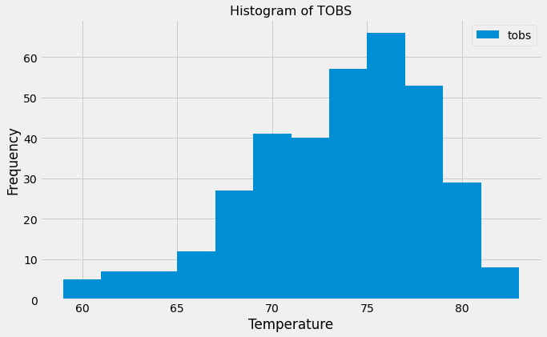

# SQLAlchemy  Project - Surfs Up!

### Python SQLAlchemy Core/ SQLAlchemy ORM queries, Pandas, and Matplotlib.

## Table of contents
* [Introduction ](#introduction )
* [Objectives ](#objectives)
* [Analysis and Observations ](#analysis-and-observation)
* [Technologies](#technologies)
* [Code](#code)
* [Status](#status)
* [Acknowledgement ](#acknowledgement )
* [Contact](#contact)



## Introduction
__Hawaii Honolulu Climate Analysis__  : *Time for a Vacation! To help me with my trip planning, I need to do some climate analysis on this area. Alright, Let's set some objective,*

### Objectives
- Perform Climate Analysis, 
- Create a climate app
- Bonus - Temperature Analysis and Calculate Daily Rainfall average

## Analysis and Observation
### Step 1 - Climate Analysis and Exploration

- Use Python and SQLAlchemy to do basic climate analysis and data exploration of your climate database. 
- Analysis must be completed using SQLAlchemy ORM queries, Pandas, and Matplotlib.

	* Use SQLAlchemy `create_engine` to connect to your sqlite database.
	* Use SQLAlchemy `automap_base()` to reflect your tables into classes and save a reference 
	   to those classes called `Station` and `Measurement`.
	* Link Python to the database by creating an SQLAlchemy session.
	* **Important** Don't forget to close out your session at the end of your notebook.

### 1. Precipitation Analysis
 - Start by finding the most recent date in the data set.
- Using this date, retrieve the last 12 months of precipitation data by querying the 12 preceding months of data. **Note** you do not pass in the date as a variable to your query.

* Select only the `date` and `prcp` values.

* Load the query results into a Pandas DataFrame and set the index to the date column.

* Sort the DataFrame values by `date`.

* Plot the results using the DataFrame `plot` method.

* Use Pandas to print the summary statistics for the precipitation data.

 

### 2. Station Analysis

* Design a query to calculate the total number of stations in the dataset.

* Design a query to find the most active stations (i.e. which stations have the most rows?).

  * List the stations and observation counts in descending order.

  * Which station id has the highest number of observations?

  * Using the most active station id, calculate the lowest, highest, and average temperature.

* Design a query to retrieve the last 12 months of temperature observation data (TOBS).

  * Filter by the station with the highest number of observations.

  * Query the last 12 months of temperature observation data for this station.

  * Plot the results as a histogram with `bins=12`

* Close out your session.

 

- - -

## Step 2 - Climate App

Based on the initial analysis, design a Flask API based on the queries that you have just developed.

* Use Flask to create your routes.

### Routes

* `/`
- Home page.
- List all routes that are available.

 

* `/api/v1.0/precipitation`
- Return a list of Measurement data ie, Date, and Precipitation of each Measuremen in the form of Dictionary.

 
  
* `/api/v1.0/stations`
- Return a JSON list of stations from the dataset.

 

* `/api/v1.0/tobs`
- Return a JSON list of temperature observations (TOBS) for the previous year.

 

* `/api/v1.0/<start>` and `/api/v1.0/<start>/<end>`
-  Return a JSON list of the minimum temperature, the average temperature, and the max temperature for a given start or start-end range.

Eg Date: 2010-02-20/2016-02-20

 

- - -------------------------------------------------------------------------------------------

## Bonus: Other Recommended Analyses

### Temperature Analysis I

* Hawaii is reputed to enjoy mild weather all year. Is there a meaningful difference between the temperature in, for example, June and December?

* Use the t-test to determine whether the difference in the means, if any, is statistically significant. Will you use a paired t-test, or an unpaired t-test? Why?

 

### Temperature Analysis II

-  Using historical data in the dataset find out what the temperature has previously looked like between August first to August seventh.
- Use the `calc_temps` function to calculate the min, avg, and max temperatures for your trip using the matching dates from a previous year (i.e., use "2017-08-01").

 

### Daily Rainfall Average

* check to see what the rainfall has been, you don't want a when it rains the whole time!

* Calculate the rainfall per weather station using the previous year's matching dates and the daily normals. 

  

## Technologies and Tools
* git Bash
* Jupyter notebook
* VS Code Editor
* Chrome Browser

### Python Modules and libraries
* pandas 
* sql alchemy
* alchemy flask
* matplotlib.pyplot
* numpy

### Database
* SQLite


## Code 
- [Climate Analysis](/climate_starter.ipynb)
- [Temperature Analysis I ](/temp_analysis_bonus_1_starter.ipynb)
- [Temperature Analysis II ](/temp_analysis_bonus_2_starter.ipynb)
- [API Script](/app.py)


## Status
Project completed

## Acknowledgement 
- Homework discussion with Courtney Gomez
- Trilogy Education Services © 2020.



## Contact
Created by [Divyashettyk@gmail.com](#divyashettyk@gmail.com)




